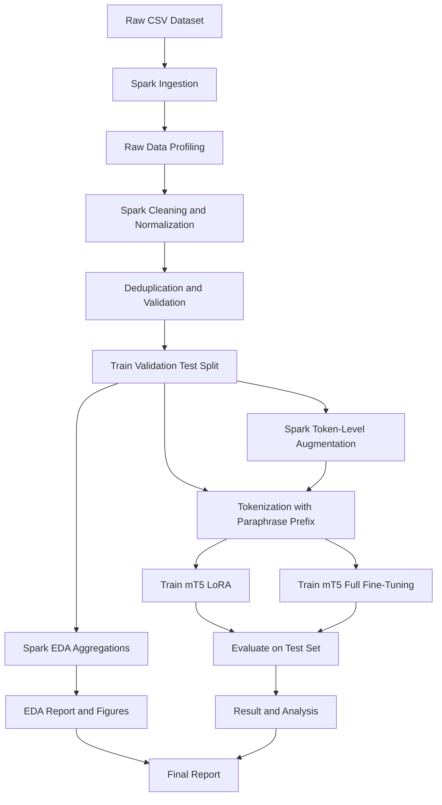

# Bangla Health Paraphrase Generation Report

## 1. Abstract

This project develops an end-to-end pipeline for Bangla healthcare paraphrase generation using a public Bangla health-related paraphrase dataset. The work focuses on transforming raw sentence-pair data into model-ready training splits through distributed preprocessing, exploratory data analysis, optional augmentation, tokenization, model training, and evaluation.

The main model is `google/mt5-small` fine-tuned with LoRA, while the baseline uses the same `google/mt5-small` backbone with full fine-tuning. PySpark is used for scalable preprocessing, EDA, validation, and augmentation before the transformer models are trained and evaluated. The current experiment shows identical automatic metric scores for the LoRA and full fine-tuning runs, which suggests that the present run establishes a reproducible baseline pipeline but does not yet demonstrate a measurable LoRA advantage.

## 2. EDA

The dataset used in this project is the Bangla health-related paraphrased dataset from Hugging Face: `faisal4590aziz/bangla-health-related-paraphrased-dataset`. The local raw CSV is stored as `datasets/all_paraphrased_data.csv`.

After preprocessing, the EDA report records `134,097` sentence pairs. Both main text columns, `source_sentence` and `paraphrased_sentence`, contain zero missing values in the processed data. This indicates that the cleaning and validation stages produced a complete paired dataset suitable for supervised paraphrase generation.

Key EDA findings:

| Metric | Value |
|---|---:|
| Total rows | 134,097 |
| Source length, mean tokens | 12.53 |
| Target length, mean tokens | 12.04 |
| Mean length ratio | 1.05 |
| Mean word overlap | 0.311 |
| Vocabulary size | 80,235 |
| Missing source sentences | 0 |
| Missing paraphrased sentences | 0 |

The source and target sentences have similar average lengths, with the target side slightly shorter on average. The mean length ratio of `1.05` suggests that paraphrases generally preserve the scale of the original sentence rather than expanding or compressing it heavily. The mean word overlap of `0.311` indicates moderate lexical overlap, which is expected for paraphrase pairs: many outputs preserve important medical or health-related terms while changing surrounding wording.

The most frequent tokens include common Bangla function words and health-domain connective terms such as `করে`, `ও`, `না`, `বা`, `হয়`, `পারে`, `এবং`, and `হবে`. These frequent tokens reflect the sentence-level nature of the data and the importance of handling common Bangla grammatical constructions during tokenization and generation.

Spark helped the EDA stage by computing token lengths, null counts, vocabulary frequencies, overlap statistics, and distribution inputs across partitions. This avoided relying on a single in-memory Python process for the full dataset and made the same analysis repeatable as part of the pipeline.

## 3. Methodology

### 3.1 Dataset and Splitting

The project uses Bangla health paraphrase pairs from `datasets/all_paraphrased_data.csv`. The configured split is:

| Split | Ratio |
|---|---:|
| Train | 80% |
| Validation | 10% |
| Test | 10% |

The random seed is fixed at `42` for reproducibility. The maximum input and target lengths are both set to `128`, while text-length filtering keeps examples between `3` and `256` tokens.

### 3.2 Preprocessing

The preprocessing stage is implemented as a Spark pipeline. It performs raw data ingestion, profiling, cleaning, deduplication, validation, and split generation. The expected pipeline order is:

1. Profile the raw CSV to inspect text columns, missing values, duplicates, and Bangla text coverage.
2. Clean text fields and normalize examples into a consistent source-target format.
3. Remove duplicate sentence pairs and optionally support near-duplicate checks using a Jaccard threshold.
4. Validate the processed rows against length and completeness constraints.
5. Write train, validation, and test splits as parquet outputs under `data/processed/`.

The generated parquet splits become the stable interface between preprocessing and model training. This makes the later stages faster to rerun because they do not need to repeat raw CSV parsing and cleaning every time.

### 3.3 How Spark Helped Distributed Processing

PySpark was important because this project performs multiple dataset-wide transformations before training. Instead of reading and transforming the full dataset in a single Python process, Spark distributes the work across partitions and executes transformations in parallel.

Spark helped in the following ways:

- **Distributed CSV and parquet processing:** Spark read the raw CSV and wrote processed parquet splits, which are more efficient for repeated downstream reads.
- **Partitioned cleaning and validation:** Text normalization, missing-value checks, token-length filtering, and schema validation were applied across distributed partitions.
- **Scalable EDA aggregation:** Counts, vocabulary statistics, token-length distributions, word-overlap measurements, and null summaries were computed using Spark aggregations.
- **Duplicate and near-duplicate handling:** Duplicate removal and optional near-duplicate logic could be handled at dataset scale using Spark transformations.
- **Distributed augmentation:** Token-level EDA augmentation, including synonym replacement, adjacent token swapping, and random deletion, was applied to the training split using Spark UDFs.
- **Checkpointed intermediate outputs:** Processed, featured, augmented, and tokenized artifacts were saved under `data/` and `outputs/`, allowing the pipeline to skip completed stages and rerun only the necessary steps.
- **Arrow support:** The configuration enables Arrow, which can improve data transfer efficiency between Spark and Python-based components when applicable.

For this project, Spark is not only a speed improvement. It also makes the preprocessing and analysis workflow more reproducible because every major data-processing stage writes explicit artifacts that can be inspected, reused, and validated.

### 3.4 Data Augmentation

The project includes optional token-level augmentation for the training split. The configured probabilities are:

| Augmentation | Probability |
|---|---:|
| Synonym replacement | 0.10 |
| Adjacent token swap | 0.05 |
| Random deletion | 0.05 |

A minimum of `3` tokens is required after augmentation. Although augmented data is generated, the current configuration has `training.use_augmented_train` set to `false`, so the reported training run uses the standard processed training split.

### 3.5 Tokenization

The mT5 models use a paraphrasing prefix:

```text
paraphrase: <source sentence>
```

This prefix frames the task for the sequence-to-sequence model. The processed train, validation, and test splits are tokenized separately for each model key and stored under `data/processed/tokenized/`.

### 3.6 Model Training

Two model variants are used:

| Model key | Backbone | Training strategy |
|---|---|---|
| `mt5_lora` | `google/mt5-small` | LoRA fine-tuning |
| `mt5_baseline` | `google/mt5-small` | Full fine-tuning |

The LoRA configuration uses rank `16`, alpha `32`, dropout `0.1`, and targets the `q` and `v` modules. Training is configured for `5` epochs with learning rate `2e-5`, weight decay `0.01`, warmup steps `500`, label smoothing `0.1`, cosine scheduling, mixed precision, gradient checkpointing, and early stopping.

### 3.7 Evaluation

The trained models are evaluated on the held-out test split using automatic generation metrics:

| Metric | Purpose |
|---|---|
| BLEU | Measures n-gram overlap with reference paraphrases. |
| ROUGE-L | Measures longest common subsequence overlap. |
| BERTScore | Measures contextual semantic similarity using `xlm-roberta-large`. |
| Distinct-1 / Distinct-2 | Measures unigram and bigram diversity in generated outputs. |
| Semantic Similarity | Measures embedding similarity using multilingual MPNet and Bengali SBERT models. |

Decoding uses beam search with `num_beams = 4` and `no_repeat_ngram_size = 3`.

## 3*. Methodology Flowchart



## 4. Result and Analysis

The current experiment evaluates both `mt5_lora` and `mt5_baseline` on the test set. The summary metrics are:

| Model | BLEU | ROUGE-L | BERTScore | Distinct-1 | Distinct-2 | SemSim MPNet | SemSim Bengali SBERT |
|---|---:|---:|---:|---:|---:|---:|---:|
| `mt5_baseline` | 0.2855 | 0.0001 | 0.7704 | 0.9988 | 1.0000 | 0.1094 | 0.1387 |
| `mt5_lora` | 0.2855 | 0.0001 | 0.7704 | 0.9988 | 1.0000 | 0.1094 | 0.1387 |

Both models produce identical scores in the current run. This means the present result does not support the hypothesis that LoRA outperforms full fine-tuning on the same mT5-small backbone. Instead, it shows that the two training paths currently reach the same measured performance under the available configuration and outputs.

The BLEU score of approximately `0.2855` indicates limited surface-level n-gram overlap with the reference paraphrases. This is not unusual for paraphrase generation because a valid paraphrase may use different wording from the reference, but it still suggests that the generated outputs need further quality improvement.

The ROUGE-L score is extremely low at approximately `0.0001`, which may indicate a mismatch between generated text and references, an evaluation formatting issue, or weak sequence overlap. This metric should be inspected carefully with sample predictions before drawing a final linguistic conclusion.

BERTScore is stronger at `0.7704`, suggesting that contextual similarity is higher than exact lexical overlap metrics imply. However, the semantic similarity scores from MPNet and Bengali SBERT are low (`0.1094` and `0.1387`), so the generated paraphrases may still be semantically distant from the target references or the embedding models may not fully capture the domain and language characteristics.

The Distinct-1 and Distinct-2 scores are very high (`0.9988` and `1.0000`), indicating high lexical diversity in generated outputs. While diversity is useful, it should be balanced against adequacy and semantic faithfulness, especially in healthcare text where preserving meaning is more important than producing varied wording.

Overall, the result confirms that the project has a working training and evaluation pipeline, but the model quality needs more investigation. The identical scores for LoRA and full fine-tuning also suggest that additional checks are needed to confirm checkpoint loading, generation outputs, and whether both evaluation runs are using distinct trained model artifacts.

## 5. Limitations and Future Work

The first limitation is that both model variants currently produce identical evaluation scores. This makes it difficult to claim that one training strategy is better than the other without further debugging, repeated runs, or manual output inspection.

The second limitation is that the reported metrics are fully automatic. Metrics such as BLEU and ROUGE-L may penalize valid paraphrases that differ lexically from the reference, while embedding-based metrics may not fully capture Bangla healthcare meaning, clinical safety, or factual preservation.

The third limitation is that the planned ablations are not fully reflected in the current reported result. The project defines hypotheses about preprocessing and augmentation, but the current report does not include separate cleaned-vs-uncleaned or augmented-vs-non-augmented comparison runs.

The fourth limitation is the healthcare domain itself. Paraphrases in this domain must preserve medical meaning, avoid hallucinated advice, and maintain clarity for users. Automatic metrics alone cannot guarantee these safety requirements.

Future work should include:

- Inspecting generated examples manually to identify common error types.
- Verifying that LoRA and baseline evaluations load distinct checkpoints.
- Running preprocessing ablations to measure the effect of cleaning.
- Training and evaluating with `training.use_augmented_train = true` to test the augmentation hypothesis.
- Adding human evaluation by Bangla speakers and, ideally, health-domain reviewers.
- Testing larger multilingual or Bangla-focused sequence-to-sequence models.
- Adding factual consistency and medical safety checks for generated paraphrases.
- Reporting confidence intervals or repeated-run averages instead of a single run.

## 6. Conclusion

This project establishes a reproducible end-to-end pipeline for Bangla healthcare paraphrase generation. It uses PySpark for distributed preprocessing, EDA, validation, and augmentation; transformer-based sequence-to-sequence models for paraphrase generation; and multiple automatic metrics for evaluation.

The current results show that both mT5-small LoRA and full fine-tuning achieve the same measured performance on the test set. Therefore, the strongest contribution of the current work is the complete data and modeling pipeline rather than a clear model-performance gain. With additional ablation experiments, checkpoint verification, qualitative analysis, and human evaluation, this project can be extended into a stronger empirical study of Bangla healthcare paraphrase generation.
